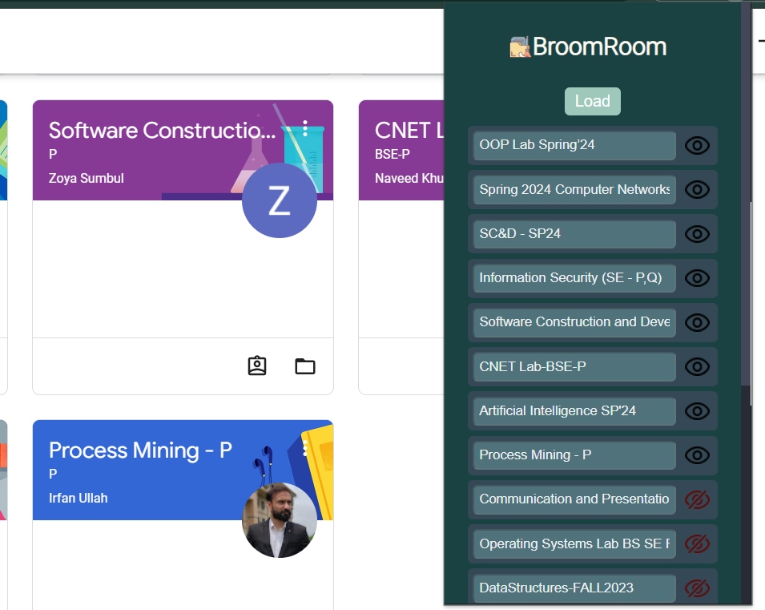

# BroomRoom

BroomRoom is a Chrome extension that helps manage your Google Classroom experience by hiding classes.

## Features

- Hide classes on Google Classroom
- Load classes with a single click
- Easy to use interface

## Installation

1. Download or clone this repository.
2. Open the Extension Management page by navigating to `chrome://extensions`.
    - Alternatively, open this page by clicking on the Extensions menu button and selecting Manage Extensions at the bottom of the menu.
    - Alternatively, open this page by clicking on the Chrome menu, hovering over More Tools then selecting Extensions.
3. Enable Developer Mode by clicking the toggle switch next to Developer mode.
4. Click the Load unpacked button and select the extension directory.

## Usage

1. Click on the BroomRoom icon in the Chrome toolbar.
2. Click the "Load" button to load your classes.
3. Use the interface to manage your classes.

## Screenshots

## Contributing

Pull requests are welcome. For major changes, please open an issue first to discuss what you would like to change.

## License

[MIT](https://choosealicense.com/licenses/mit/)